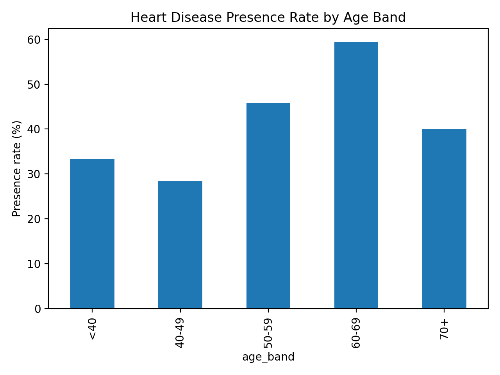
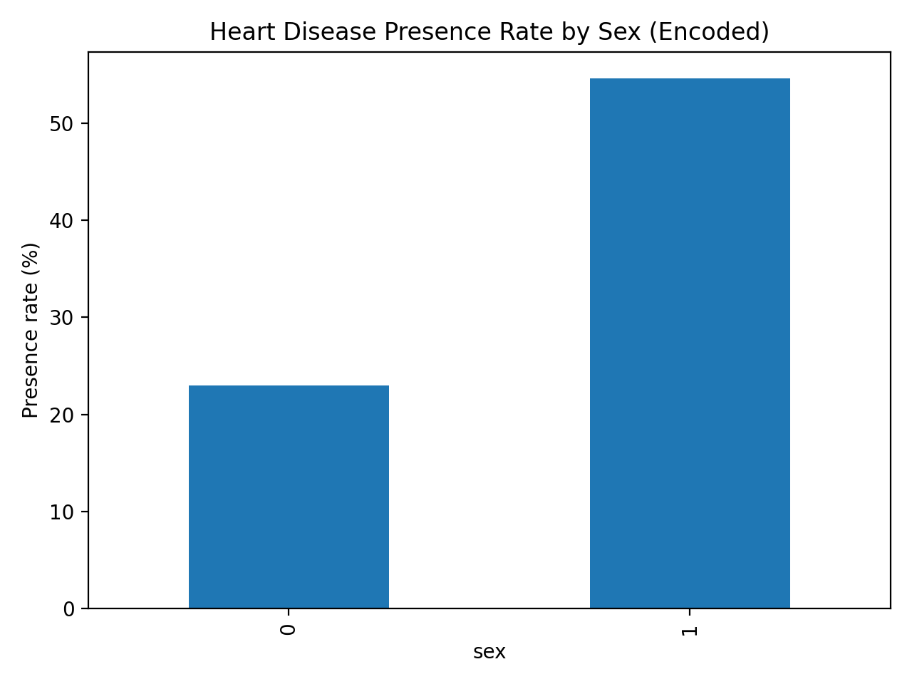

# Heart Disease SQL Analysis

## Project Overview
This project explores a heart disease dataset using SQL and Python to understand key risk factors associated with cardiovascular disease. The analysis follows a structured, end-to-end workflow including schema inspection, data quality validation, exploratory data analysis, and the creation of an interpretable risk scoring model.

The goal of this project is to demonstrate analytical thinking, SQL proficiency, and the ability to extract meaningful insights from real-world health data.

---

## Dataset Description
The dataset contains **270 patient records** with the following variables:

- **age** – Patient age (years)
- **sex** – Binary encoded sex variable
- **bp** – Resting blood pressure
- **cholesterol** – Serum cholesterol level
- **Max HR** – Maximum heart rate achieved
- **Heart Disease** – Target variable (`Presence` or `Absence`)

---

## Analysis Workflow

### 1. Schema Inspection (`01_schema.sql`)
- Identified table structure and column data types
- Verified correct table creation
- Previewed sample rows for validation

### 2. Data Quality Checks (`02_data_quality.sql`)
- Confirmed no missing values in key variables
- Validated realistic physiological ranges
- Verified absence of duplicate records
- Confirmed consistent target variable encoding

**Result:** Dataset deemed suitable for analysis without additional cleaning.

---

### 3. Exploratory Data Analysis (`03_exploratory_analysis.sql`)
Key findings:
- Overall heart disease prevalence: **44.44%**
- One sex group exhibited more than **2× higher prevalence**
- Patients with heart disease were:
  - Older on average
  - More likely to have higher blood pressure
  - More likely to have elevated cholesterol
  - Associated with lower maximum heart rate
- Heart disease prevalence increased significantly with age, particularly after age 50

---

## Visualizations (Python)

To complement the SQL-based analysis, Python was used to visualize key patterns identified during exploratory analysis. Pandas was used for data manipulation and Matplotlib for visualization, with results saved directly to the repository for reproducibility.

### Heart Disease Presence Rate by Age Band
This chart visualizes the proportion of patients with heart disease across defined age groups.

**Insight:**  
Heart disease prevalence increases steadily with age, with a pronounced rise beginning in the 50–59 age group and peaking among patients aged 60–69. This reinforces the age-related trends observed in the SQL analysis.

---

### Heart Disease Presence Rate by Sex
This chart compares heart disease prevalence between the two encoded sex groups.

**Insight:**  
One sex group exhibits more than double the heart disease prevalence compared to the other, consistent with the statistical differences identified during exploratory analysis.

---

### 4. Risk Analysis (`04_risk_analysis.sql`)
A simple, rule-based risk score was constructed using five interpretable clinical factors:

- Age ≥ 55
- Blood pressure ≥ 140
- Cholesterol ≥ 240
- Maximum heart rate < 120
- Sex belonging to the higher-risk group

Each factor contributed one point to a total risk score (0–5).

**Results:**
- Heart disease prevalence increased monotonically with risk score
- Low-risk group (score = 0): **0% prevalence**
- High-risk group (score ≥ 4): **~86% prevalence**
- Maximum risk group (score = 5): **100% prevalence**

This demonstrates that a small number of interpretable features can effectively stratify cardiovascular risk.

---

## Tools Used
- **SQLite**
- **SQL**
- **Python (Pandas, Matplotlib)**
- **VS Code**
- **Git & GitHub**

---

## Key Takeaways
- Clean, well-structured data enables reliable analysis
- Simple SQL-based techniques can uncover clinically meaningful patterns
- Interpretable models provide strong insight without requiring machine learning

---

## Future Improvements
- Visualize results using Python (Pandas / Matplotlib)
- Compare rule-based scoring to a logistic regression model
- Add confidence intervals and statistical testing